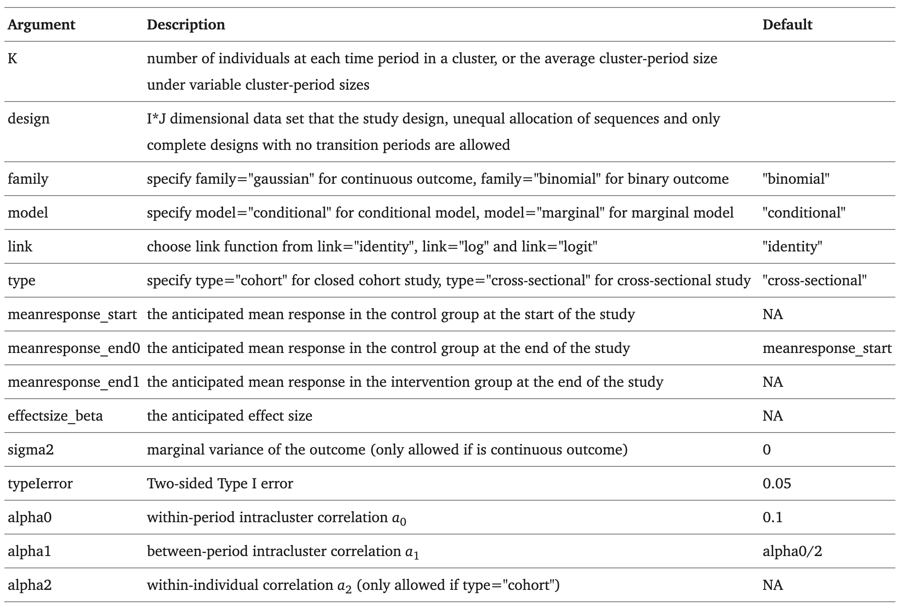

# swdpwr: Power Calculations in Stepped Wedge Cluster Randomized Trials

A pictorial representation of a stepped wedge trial, adapted from [Prof Karla Hemming & Prof Monica Taljaard. (2020). When is a stepped-wedge cluster randomised trial a good design choice? Research OUTREACH. (121)](https://researchoutreach.org/articles/stepped-wedge-cluster-randomised-trial-good-design-choice/) 

## 1. Methods and Scenarios Implemented in swdpwr


Hussey, M. A., & Hughes, J. P. (2007). Design and analysis of stepped wedge cluster randomized trials. Contemporary clinical trials, 28(2), 182-191.

Hooper, R., Teerenstra, S., de Hoop, E., & Eldridge, S. (2016). Sample size calculation for stepped wedge and other longitudinal cluster randomised trials. Statistics in medicine, 35(26), 4718-4728.

Li, F., Turner, E. L., & Preisser, J. S. (2018a). Sample size determination for GEE analyses of stepped wedge cluster randomized trials. Biometrics, 74(4), 1450-1458.

Li, F., Turner, E. L., & Preisser, J. S. (2018b). Optimal allocation of clusters in cohort stepped wedge designs. Statistics Probability Letters, 137, 257-263.

Zhou, X., Liao, X., Kunz, L. M., Normand, S. L. T., Wang, M., & Spiegelman, D. (2020). A maximum likelihood approach to power calculations for stepped wedge designs of binary outcomes. Biostatistics, 21(1), 102-121.

Zhou, X., Liao, X., & Spiegelman, D. (2017). “Cross-sectional” stepped wedge designs always reduce the required sample size when there is no time effect. Journal of clinical epidemiology, 83, 108-109.

## 2. R Package Installation
The R package has versions of **Package source**, **Windows binaries**, and **macOS binaries** maintained on CRAN: [https://CRAN.R-project.org/package=swdpwr](https://CRAN.R-project.org/package=swdpwr). The binary package can be installed by:
```r
install.packages("swdpwr")
library(swdpwr)
```

## 3. Usage
```r
swdpower(K, design, family, model, link, type, meanresponse_start, meanresponse_end0, meanresponse_end1, effectsize_beta, sigma2, typeIerror, alpha0, alpha1, alpha2)
```
## 4. Arguments


## 5. Details
This function `swdpower` performs power calculations for stepped wedge cluster randomized trials under different scenarios (presented in Section 1). 
### A note on assumptions on time effects
The default setting assumes no time effect, meaning the anticipated mean response in the control group at the end of the study (`meanresponse_end0`) is equal to that at the start of the study (`meanresponse_start`). To incorporate time effects, you can manually set `meanresponse_start` and `meanresponse_end0` to different values. For a model with time effects but approximating a "zero time trend", this can be achieved by setting `meanresponse_start` and `meanresponse_end0` to values that are close but slightly different, such as `meanresponse_start = x` and `meanresponse_end0 = x + 0.001` (with the difference being greater than 1e-5).

## 6. Return
The object returned by function `swdpower` has a class of `swdpower`, which includes a list of the design matrix and a summary of this design (including the power).

## 7. Useful Examples
### Example 1. Conditional model with binary outcome and cross-sectional design
**Note**: With binary outcomes, **the variance argument `sigma2` is undefined and should not be specified**. Due to this specific cross-sectional setting, we specify `α0 =α1` in the function and **`α2` is also undefined and should not be specified**. Details can be referred to in our paper if you are interested.

An investigator plans to conduct a cross-sectional stepped wedge design with 12 clusters and 3 periods, in which clusters are randomly allocated to one of the two sequences (6
clusters per sequence). 

- This trial has an average of 50 individuals per cluster per period with a total sample size of 1800, and measurements on the binary outcome will be taken.
- The baseline proportion is assumed to be 0.2 and is expected to increase to 0.25 by the end of the study even in the absence of the intervention (due to the secular trend). 
- The risk difference (RD) by the end of the study is specified to be 0.13 and thus it’s convenient to use the identity link under the conditional model (with the treatment effect `β` to be also 0.13 for this model configuration). 
- The investigator assumes a constant intracluster correlation coefficient (ICC) over time, equal to 0.01 on the proportions scale, here interpreted as the correlation between different individuals within the same cluster. 
- The treatment effect is to be tested at a two-sided 5% level of significance.

Fitting the model with all above required inputs in R:
```r
library("swdpwr")
dataset = matrix(c(rep(c(0, 1, 1), 6), rep(c(0, 0, 1), 6)), 12, 3, byrow = TRUE)
swdpower(K = 50, design = data, family = "binomial", model = "conditional", link = "identity", type = "cross-sectional", meanresponse_start = 0.2, meanresponse_end0 = 0.25,
meanresponse_end1 = 0.38, typeIerror = 0.05, alpha0 = 0.01, alpha1 = 0.01)
```

The ouput will be:
```r
This cross-sectional study has total sample size of 1800
Power for this scenario is 0.899 for the alternative hypothesis treatment effect beta = 0.13 ( two-sided Type I error = 0.05 )
```

### Example 2. Marginal model for binary outcomes with cohort design
**Note**: A cohort design requires the specification of `α0`, `α1` and `α2`.

An investigator plans to conduct a closed cohort stepped wedge design with 12 clusters and 4 periods, in which clusters are randomly allocated to one of the two sequences (6 clusters
per sequence). 

- This trial has an average of 100 individuals per cluster with a total sample size of 1200, and repeated measurements on each individual at each period for the binary outcome will be taken.
- The baseline proportion is assumed to be 0.156 and is expected to increase to 0.1765 by the end of the study even in the absence of the intervention (due to the secular trend).
- The relative risk (RR) by the end of the study is specified to be $e^{0.75}$ and thus it’s intuitive to use the log link under the marginal model (with the treatment effect `β` to be 0.75 for this model configuration).
- The investigator is anticipating a within-period ICC of 0.03, a between-period ICC of 0.015, and a within-individual correlation in repeated measures on the same individual of 0.2 on the proportions scale.
- The treatment effect is to be tested at a two-sided 5% level of significance.

Fitting the model with all above required inputs in R:
```r
library("swdpwr")
dataset = matrix(c(rep(c(0, 1, 1, 1), 6), rep(c(0, 0, 1, 1), 6)), 12, 4, byrow = TRUE)
swdpower(K = 100, design = dataset, family = "binomial", model = "marginal", link = "log", type = "cohort", meanresponse_start = 0.156, meanresponse_end0 = 0.1765,
effectsize_beta = 0.75, typeIerror = 0.05, alpha0 = 0.03, alpha1 = 0.015, alpha2 = 0.2)
```

The ouput will be:
```r
This cohort study has total sample size of 1200
Power for this scenario is 0.983 for the alternative hypothesis treatment effect beta = 0.75 (two-sided Type I error = 0.05 )
```

### Example 3. Marginal model for binary outcomes with cross-sectional design
An investigator plans to conduct a cross-sectional stepped wedge design with 12 clusters and 4 periods, in which clusters are randomly allocated to one of the two sequences
(6 clusters per sequence). 

- This trial has an average of 100 individuals per cluster per period with a total sample size of 4800, and measurements on the binary outcome will be taken.
- The baseline proportion is assumed to be 0.15 and no changes are expected by the end of the study even in the absence of the intervention (no secular trend).
- The risk difference (RD) by the end of the study is specified to be 0.05 and thus it’s convenient to use the
identity link under the marginal model (with the treatment effect `β` to be also 0.05 for this model configuration).
- The investigator is anticipating a within-period ICC of 0.02 and a between-period ICC of 0.015 on the proportions scale.
- The treatment effect is to be tested at a two-sided 5% level of significance.

Fitting the model with all required inputs in R:
```r
library("swdpwr")
dataset = matrix(c(rep(c(0, 1, 1, 1), 6), rep(c(0, 0, 1, 1), 6)), 12, 4, byrow = TRUE)
swdpower(K = 100, design = dataset, family = "binomial", model = "marginal", link = "identity", type = "cross-sectional", meanresponse_start = 0.15,
meanresponse_end0 = 0.15, meanresponse_end1 = 0.2, typeIerror = 0.05, alpha0 = 0.02, alpha1 = 0.015)
```

The ouput will be:
```r
This cross-sectional study has total sample size of 4800
Power for this scenario is 0.946 for the alternative hypothesis treatment effect beta = 0.05 (two-sided Type I error = 0.05 )
```
### Example 4. Method with continuous outcomes under identity link
**Note**: **The designs for continuous outcomes are conducted under the identity link function**. Both cross-sectional and cohort designs with and without time effects can be accommodated in our software. **Here, the argument `sigma2` must be specified**. Details can be referred to in our paper if you are interested.

An investigator plans to conduct a closed cohort stepped wedge design with 8 clusters and 3 periods, in which clusters are randomly allocated to one of the two sequences (4 clusters per sequence).

- This trial has an average of 24 individuals per cluster per period with a total sample size of 192, and measurements on the continuous outcome will be taken.
- Continuous outcomes will be explained under the marginal model with identity link.
- The baseline mean response is assumed to be 0.1 and is expected to increase to 0.2 by the end of the study even in the absence of the intervention (due to the secular trend).
- The mean response difference by the end of the study is specified to be 0.2 (with the treatment effect `β` to be also 0.2 for this model configuration).
- The investigator is anticipating a within-period ICC of 0.03, a between-period ICC of 0.015, and a within-individual correlation in repeated measures on the same individual of 0.2.
- The marginal variance of the outcomes is set to be 0.095, which is a required input for continuous outcomes.
- The treatment effect is to be tested at a two-sided 5% level of significance.

The implementation in R is:
```r
library("swdpwr")
dataset = matrix(c(rep(c(0, 1, 1),4), rep(c(0, 0, 1), 4)), 8, 3, byrow= TRUE)
swdpower(K = 24, design = dataset, family = "gaussian", model = "marginal", link = "identity", type = "cohort", meanresponse_start = 0.1,
meanresponse_end0 = 0.2, effectsize_beta = 0.2, sigma2 = 0.095, typeIerror = 0.05, alpha0 = 0.03, alpha1 = 0.015, alpha2 = 0.2)
```

The ouput will be:
```r
This cohort study has total sample size of 192
Power for this scenario is 0.965 for the alternative hypothesis treatment effect beta = 0.2 (two-sided Type I error = 0.05 )
```
**We also consider the same example without secular trends (time effects are zero)** In the example below, only `effectsize_beta` is specified and the trial was conducted without time effects by default.

The implementation in R is:
```r
library("swdpwr")
dataset = matrix(c(rep(c(0, 1, 1),4), rep(c(0, 0, 1), 4)), 8, 3, byrow= TRUE)
swdpower(K = 24, design = dataset, family = "gaussian", model = "marginal", link = "identity", type = "cohort", effectsize_beta = 0.2, sigma2 = 0.095, typeIerror = 0.05, alpha0 = 0.03, alpha1 = 0.015, alpha2 = 0.2)
```

The ouput will be:
```r
This cohort study has total sample size of 192
Power for this scenario is 1 for the alternative hypothesis treatment effect beta = 0.2 (two-sided Type I error = 0.05 )
```


## 8. Citation
If you use our ONDSA R package in your research, please cite our related publication/software (https://doi.org/10.1016/j.cmpb.2021.106522).
Chen, J., Zhou, X., Li, F., & Spiegelman, D. (2022). swdpwr: A SAS macro and an R package for power calculations in stepped wedge cluster randomized trials. Computer methods and programs in biomedicine, 213, 106522.

## 9. Contact
If you have any questions or suggestions, please create an issue on GitHub or contact the author/maintainer Jiachen Chen (chenjc@bu.edu).


